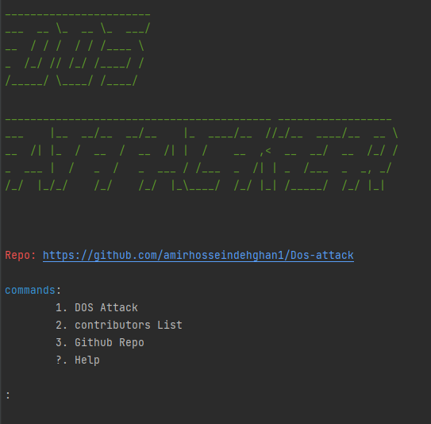

# Dos-attack

### a simple and light way python script for testing a web site 

### how to use:

#### 0.0 creating a virtual enviorment    
    python3 -m venv venv
    or 
    python -m venv venv

#### 0.1 activating virtual enviorment
    
    .\venv\Scripts\activate
    or
    source venv/bin/activate

#### 0.2 installing dependencies
    
    pip install -r requirements.txt
    or      
    pip3 install -r requirements.txt

##### 0.3 Run:
    python Dos.py